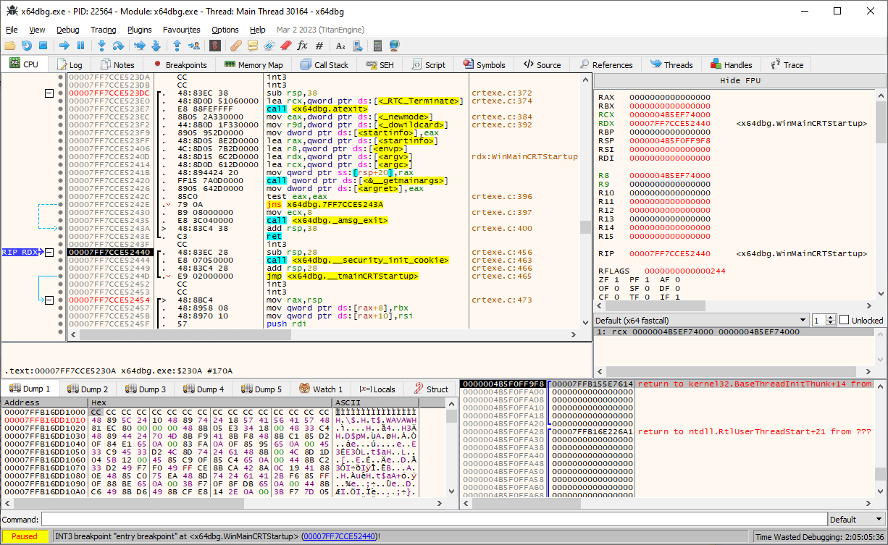
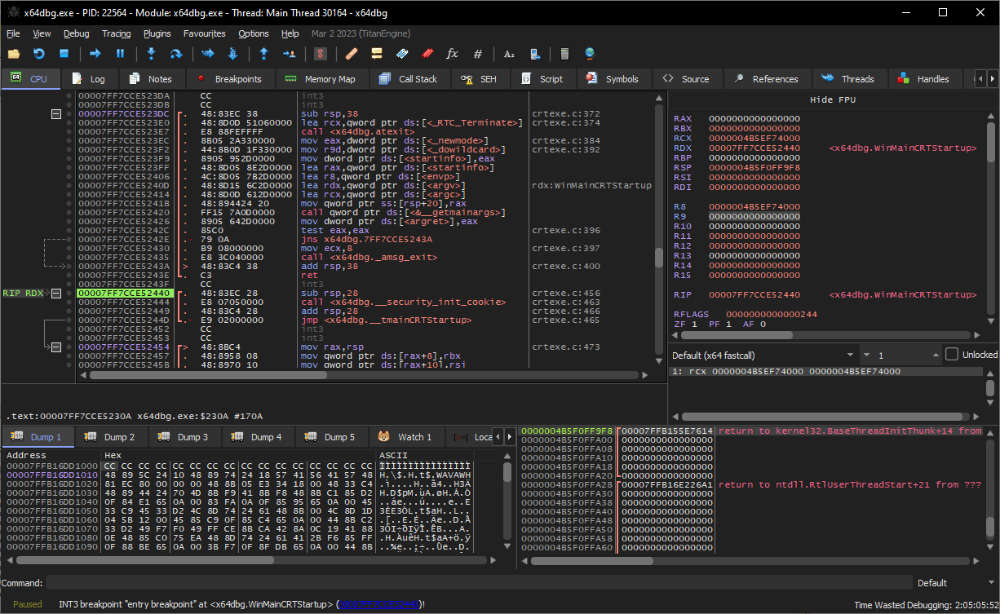
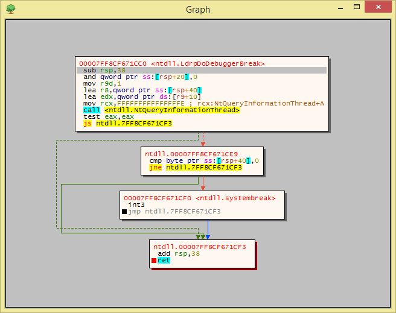
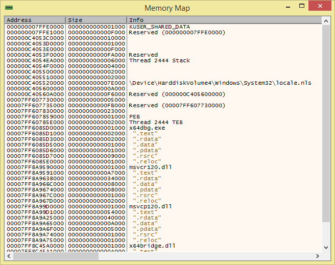

# x64dbg

  

   

An open-source binary debugger for Windows, aimed at malware analysis and reverse engineering of executables you do not have the source code for. There are many features available and a comprehensive [plugin system](http://plugins.x64dbg.com) to add your own. You can find more information on the [blog](https://x64dbg.com/blog)!

## Screenshots

|  |  |
| :--: | :--: |

## Installation & Usage

1. Download a snapshot from [GitHub](https://github.com/x64dbg/x64dbg/releases), [SourceForge](https://sourceforge.net/projects/x64dbg/files/snapshots) or [OSDN](https://osdn.net/projects/x64dbg) and extract it in a location your user has write access to.
2. _Optionally_ use `x96dbg.exe` to register a shell extension and add shortcuts to your desktop.
3. You can now run `x32\x32dbg.exe` if you want to debug a 32-bit executable or `x64\x64dbg.exe` to debug a 64-bit executable! If you are unsure you can always run `x96dbg.exe` and chose your architecture there.

You can also [compile](https://github.com/x64dbg/x64dbg/wiki/Compiling-the-whole-project) x64dbg yourself with a few easy steps!

## Sponsors

 

## Contributing

This is a community effort and we accept pull requests! See the [CONTRIBUTING](https://github.com/x64dbg/x64dbg/blob/development/CONTRIBUTING.md) document for more information. If you have any questions you can always [contact us](https://x64dbg.com/#contact) or open an [issue](https://github.com/x64dbg/x64dbg/issues). You can take a look at the [easy issues](https://github.com/x64dbg/x64dbg/issues?q=is%3Aissue+is%3Aopen+label%3Aeasy) to get started.

## Credits

- Debugger core by [TitanEngine Community Edition](https://github.com/x64dbg/TitanEngine)
- Disassembly powered by [Zydis](https://zydis.re)
- Assembly powered by [XEDParse](https://github.com/x64dbg/XEDParse) and [asmjit](https://github.com/asmjit)
- Import reconstruction powered by [Scylla](https://github.com/NtQuery/Scylla)
- JSON powered by [Jansson](https://www.digip.org/jansson)
- Database compression powered by [lz4](https://bitbucket.org/mrexodia/lz4)
- Bug icon by [VisualPharm](https://www.visualpharm.com)
- Interface icons by [Fugue](https://p.yusukekamiyamane.com)
- Website by [tr4ceflow](https://tr4ceflow.com)

## Developers

- [mrexodia](https://mrexodia.github.io)
- Sigma
- [tr4ceflow](https://blog.tr4ceflow.com)
- [Dreg](https://www.fr33project.org)
- [Nukem](https://github.com/Nukem9)
- [Herz3h](https://github.com/Herz3h)
- [torusrxxx](https://github.com/torusrxxx)

## Code contributions

You can find an exhaustive list of GitHub contributors [here](https://github.com/x64dbg/x64dbg/graphs/contributors).

## Special Thanks

- Sigma for developing the initial GUI
- All the donators!
- Everybody adding issues!
- People I forgot to add to this list
- [Writers of the blog](https://x64dbg.com/blog/2016/07/09/Looking-for-writers.html)!
- [EXETools community](https://forum.exetools.com)
- [Tuts4You community](https://forum.tuts4you.com)
- [ReSharper](https://www.jetbrains.com/resharper)
- [Coverity](https://www.coverity.com)
- acidflash
- cyberbob
- cypher
- Teddy Rogers
- TEAM DVT
- DMichael
- Artic
- ahmadmansoor
- \_pusher\_
- firelegend
- [kao](https://lifeinhex.com)
- sstrato
- [kobalicek](https://github.com/kobalicek)
- [athre0z](https://github.com/athre0z)
- [ZehMatt](https://github.com/ZehMatt)
- [mrfearless](https://twitter.com/fearless0)
- [JustMagic](https://github.com/JustasMasiulis)

Without the help of many people and other open-source projects, it would not have been possible to make x64dbg what is it today, thank you!
